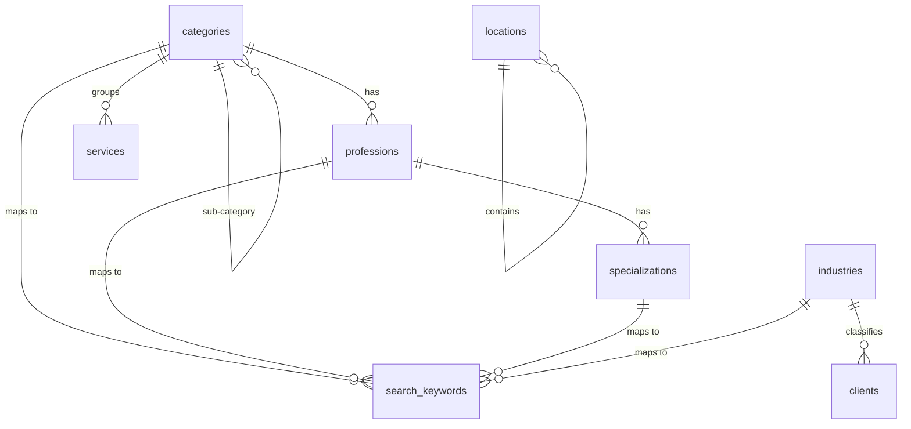
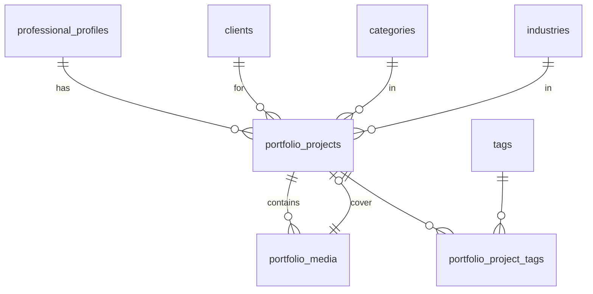
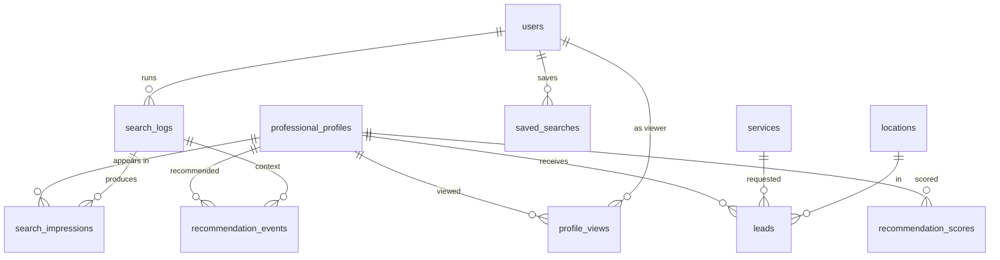
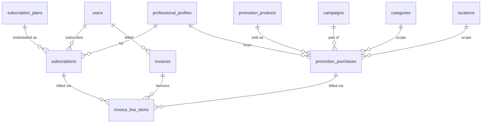
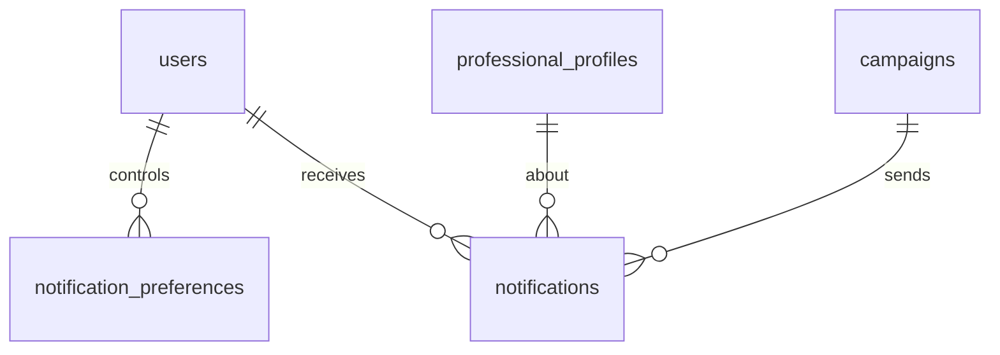
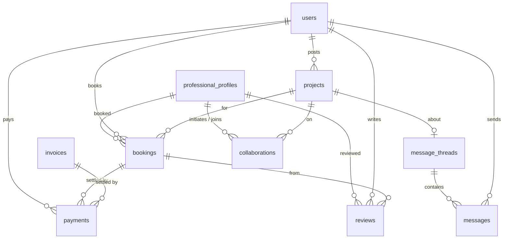

# Entity-Relationship Diagrams

Rendered with Mermaid (GitHub renders these natively). Split by domain for
readability; junction tables are shown as the many-to-many crossings they
implement. See [DATA_MODEL.md](./DATA_MODEL.md) for full column detail.

Cardinality: `||` one · `o{` zero-or-many · `|{` one-or-many · `o|` zero-or-one.

## Taxonomy backbone

## Identity & profile core

```mermaid
erDiagram
    users                 ||--o{ professional_profiles : "owns"
    locations             ||--o{ professional_profiles : "based in"
    professional_profiles ||--o{ profile_categories      : ""
    professional_profiles ||--o{ profile_professions     : ""
    professional_profiles ||--o{ profile_specializations : ""
    professional_profiles ||--o{ profile_industries      : ""
    professional_profiles ||--o{ profile_services        : ""
    professional_profiles ||--o{ profile_languages       : ""
    professional_profiles ||--o{ profile_tags            : ""
    professional_profiles ||--o{ profile_areas_served    : ""
    professional_profiles ||--o{ profile_equipment       : ""
    professional_profiles ||--o{ profile_clients         : ""
    professional_profiles ||--o{ profile_links           : ""
    professional_profiles ||--o{ awards                  : ""
    professional_profiles ||--o| availability            : "1:1"
    professional_profiles ||--o{ verification_records    : ""
    professional_profiles ||--o{ profile_score_snapshots : ""

    categories      ||--o{ profile_categories      : ""
    professions     ||--o{ profile_professions     : ""
    specializations ||--o{ profile_specializations : ""
    industries      ||--o{ profile_industries      : ""
    services        ||--o{ profile_services        : ""
    languages       ||--o{ profile_languages       : ""
    tags            ||--o{ profile_tags            : ""
    locations       ||--o{ profile_areas_served    : ""
    equipment       ||--o{ profile_equipment       : ""
    clients         ||--o{ profile_clients         : ""
```

## Portfolio

## Engagement, search & recommendation

`ranking_factor_weights` has no FKs — it is a standalone, admin-tunable config
table read by the matching engine, keyed by `(factor_key, context)`.

## Monetization

## Communication

## Future products

